Ссылка на колаб: https://colab.research.google.com/drive/17jFycSJsyMkLSRw18C0BZw78ciTV2tAw?usp=sharing

HTML-файлы с результатами FastQC лежат в папке data, вот некоторые скриншоты из них по каждому образцу:

- SRR3414629

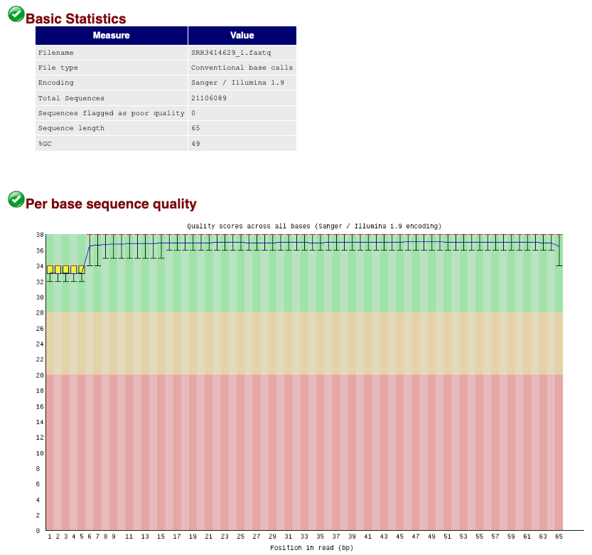
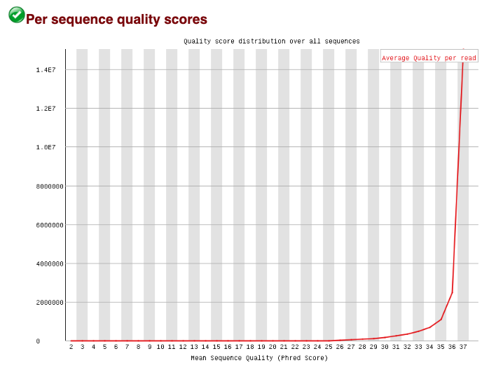
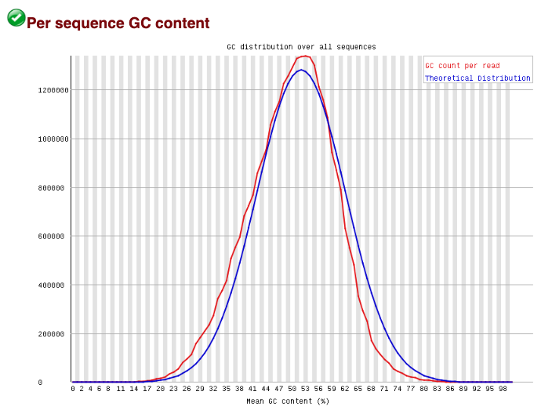

- SRR3414630

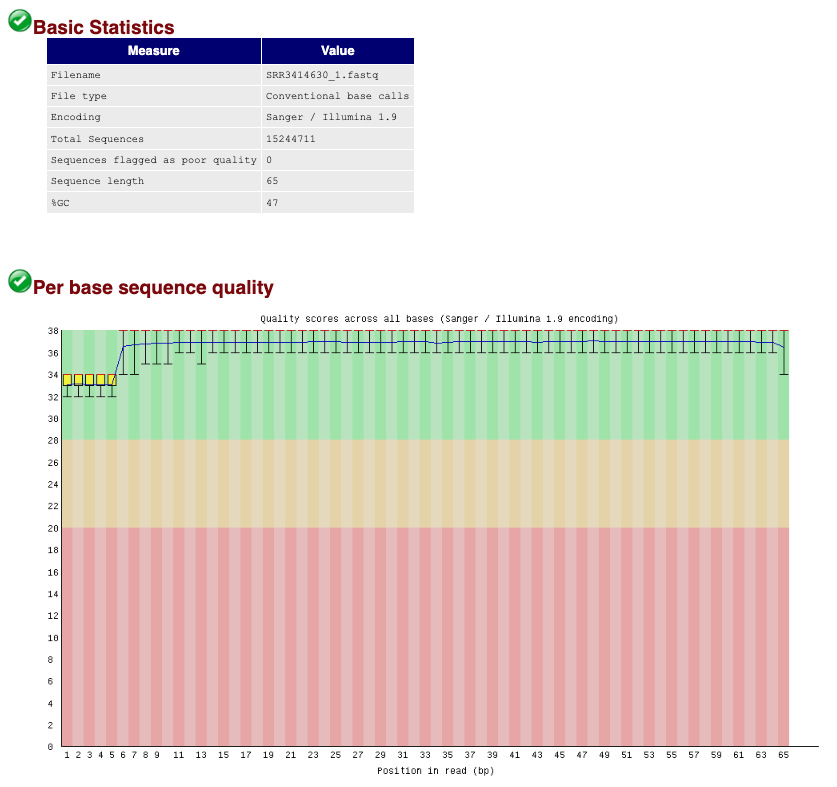

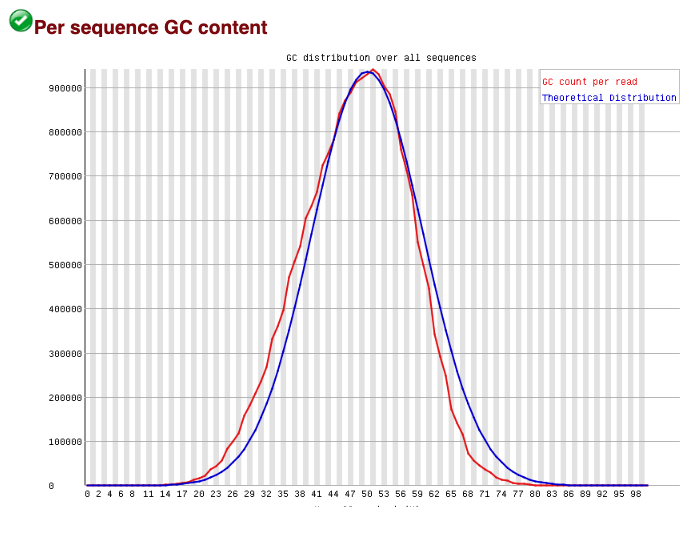

- SRR3414631

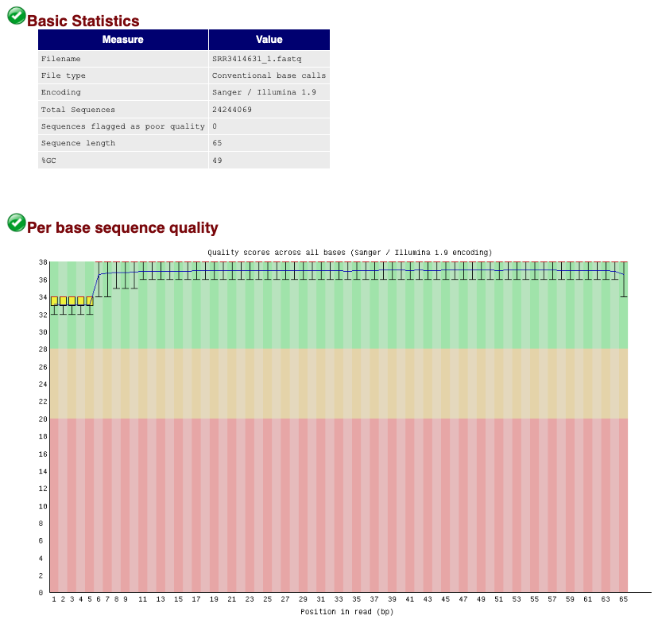
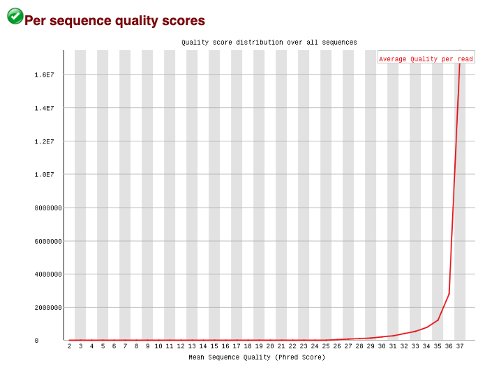


- SRR3414635

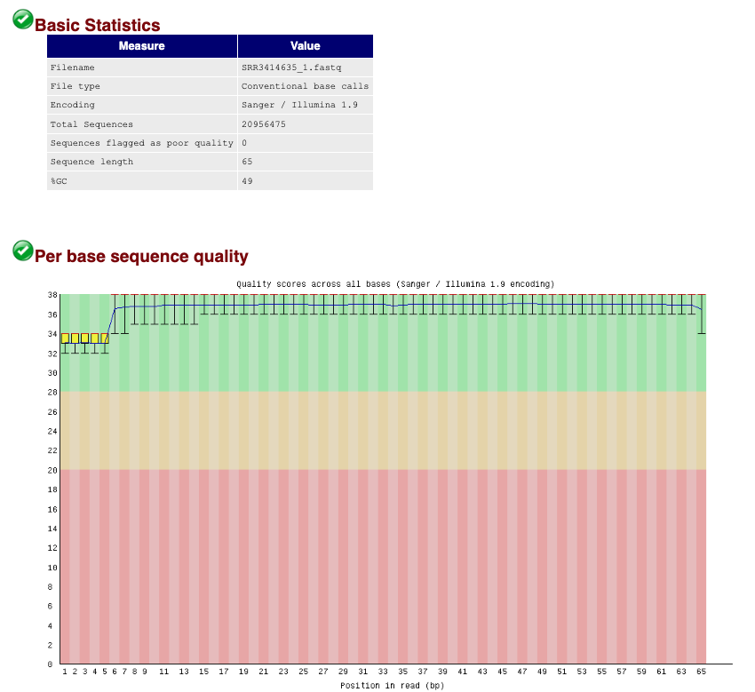
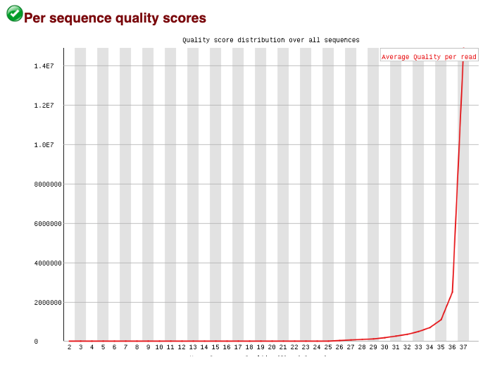
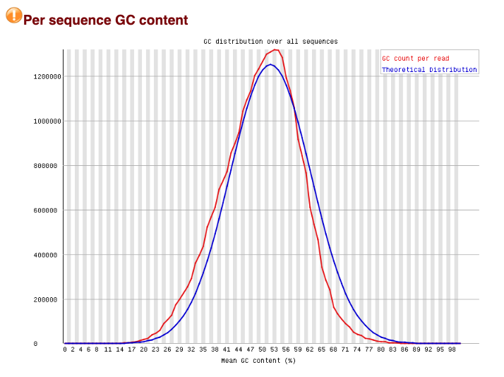

- SRR3414636

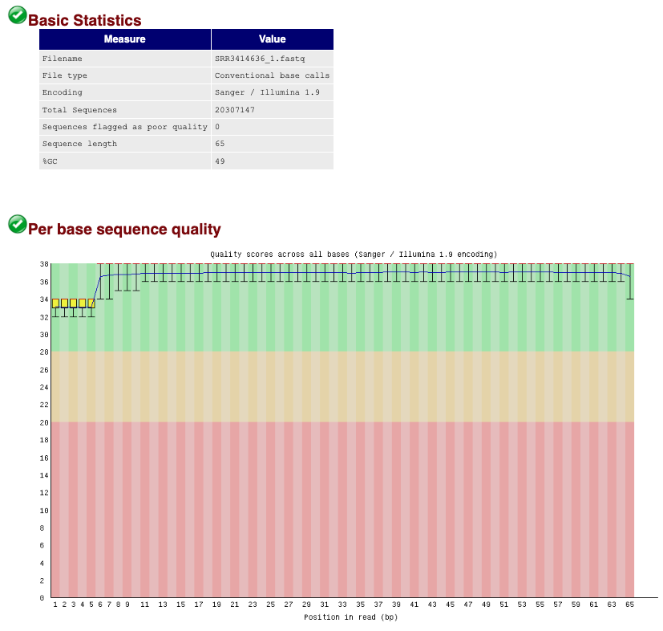
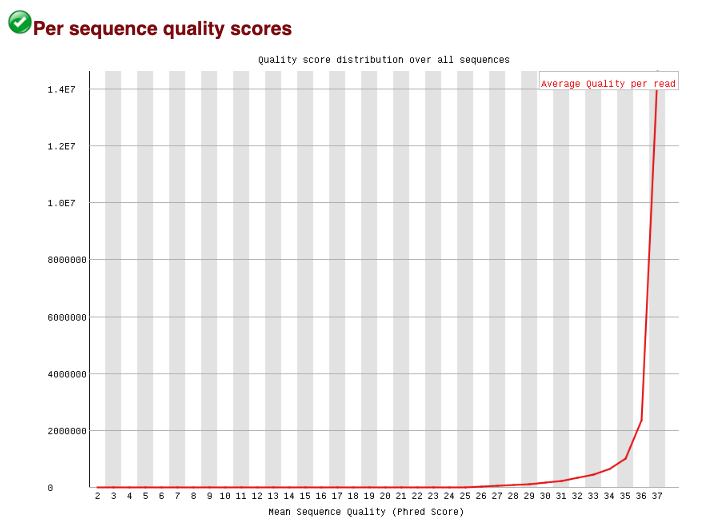
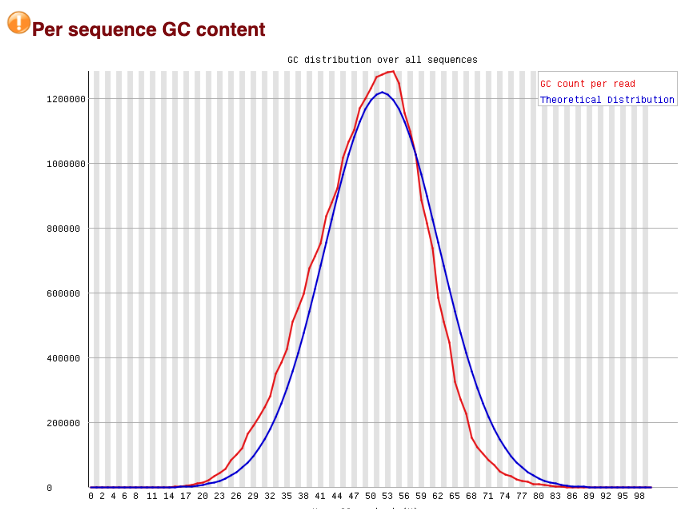

- SRR3414637

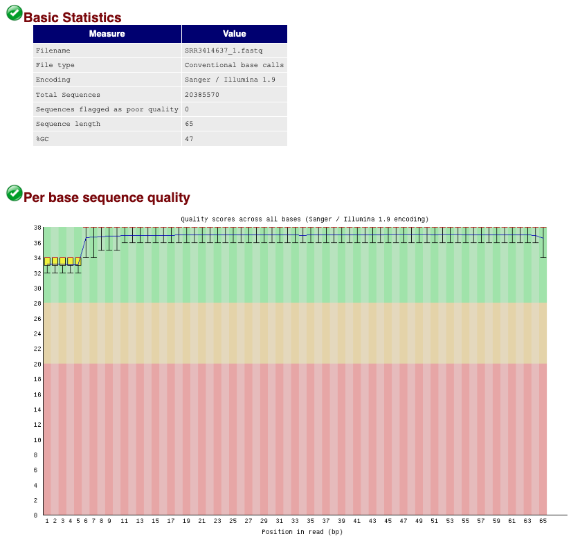
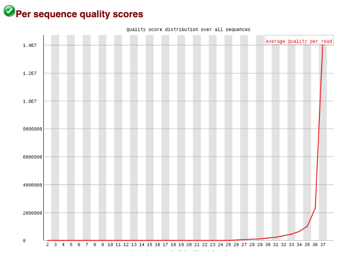
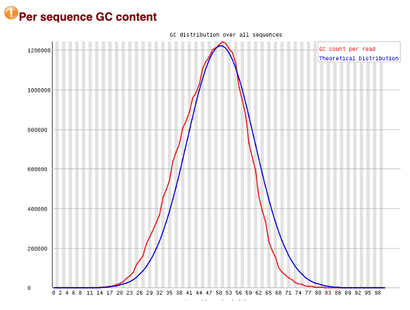

Статистика попаданий чтений на гены для каждого образца из результатов работы программы HTSeq:

```
SRR3414629
__no_feature	1620359
__ambiguous	728893
__too_low_aQual	0
__not_aligned	0
__alignment_not_unique	0

SRR3414630
__no_feature	1251763
__ambiguous	484967
__too_low_aQual	0
__not_aligned	0
__alignment_not_unique	0

SRR3414631
__no_feature	1718354
__ambiguous	827751
__too_low_aQual	0
__not_aligned	0
__alignment_not_unique	0

SRR3414635
__no_feature	1406679
__ambiguous	767361
__too_low_aQual	0
__not_aligned	0
__alignment_not_unique	0

SRR3414636
__no_feature	1347210
__ambiguous	742802
__too_low_aQual	0
__not_aligned	0
__alignment_not_unique	0

SRR3414637
__no_feature	1411488
__ambiguous	717538
__too_low_aQual	0
__not_aligned	0
__alignment_not_unique	0
```

Результаты картирования с помощью HISAT2:
```
SRR3414629
21106089 reads; of these:
  21106089 (100.00%) were unpaired; of these:
    241118 (1.14%) aligned 0 times
    18573565 (88.00%) aligned exactly 1 time
    2291406 (10.86%) aligned >1 times
98.86% overall alignment rate

SRR3414630
15244711 reads; of these:
  15244711 (100.00%) were unpaired; of these:
    168274 (1.10%) aligned 0 times
    13320505 (87.38%) aligned exactly 1 time
    1755932 (11.52%) aligned >1 times
98.90% overall alignment rate

SRR3414631
24244069 reads; of these:
  24244069 (100.00%) were unpaired; of these:
    279694 (1.15%) aligned 0 times
    21159606 (87.28%) aligned exactly 1 time
    2804769 (11.57%) aligned >1 times
98.85% overall alignment rate

SRR3414635
20956475 reads; of these:
  20956475 (100.00%) were unpaired; of these:
    242044 (1.15%) aligned 0 times
    18637053 (88.93%) aligned exactly 1 time
    2077378 (9.91%) aligned >1 times
98.85% overall alignment rate

SRR3414636
20307147 reads; of these:
  20307147 (100.00%) were unpaired; of these:
    233551 (1.15%) aligned 0 times
    18032679 (88.80%) aligned exactly 1 time
    2040917 (10.05%) aligned >1 times
98.85% overall alignment rate

SRR3414637
20385570 reads; of these:
  20385570 (100.00%) were unpaired; of these:
    236895 (1.16%) aligned 0 times
    18043406 (88.51%) aligned exactly 1 time
    2105269 (10.33%) aligned >1 times
98.84% overall alignment rate
```
